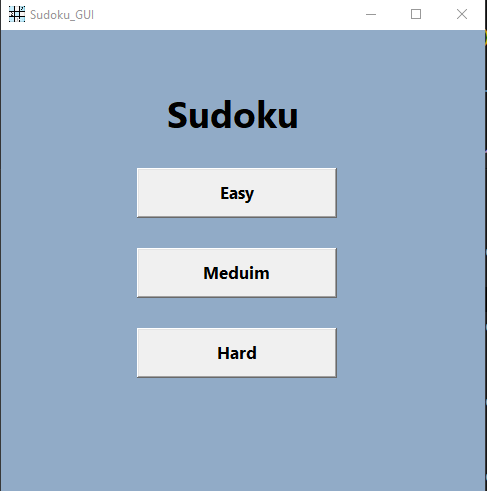
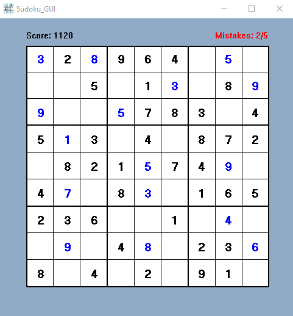

# Sudoku
This is a basic beginner Sudoku project made with the C language using Windows API. It
It has a GUI and you can play Sudoku puzzles with custom difficulty.

# Prerequisites
- GCC compiler 
- Windows operating system

# How to run 
```
make
```
If you don't have make installed run directly 
```
gcc src/main.c src/sudoku_gui.c -o main -mwindows; ./main.exe
```

# Screenshots



